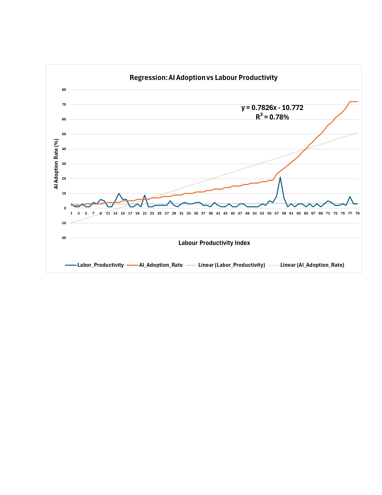

# 📊 Enterprise AI Adoption & Productivity Analysis

> **Research Question:** How is enterprise AI adoption affecting productivity metrics and workforce composition across different industries (2006–2025)? Is it good to invest in AI?


---


## 📉 Regression Chart



> Figure 2: Regression of AI Adoption Rate vs Labour Productivity Index (2006–2025).  
> Equation: `y = 0.7826x − 10.772` — R² = 0.786
## 📌 Overview

A multivariate regression study examining the relationship between global enterprise AI adoption and U.S. labour productivity over 80 quarterly observations (2006 Q1 → 2025 Q1). The analysis covers the full analytics pipeline — from raw data ingestion and cleaning through descriptive statistics, correlation analysis, hypothesis testing, and multiple linear regression.

**Bottom line:** Invest in enterprise AI, but pair it with wage discipline and measured hiring to unlock measurable productivity gains.

---

## 🔢 Key Numbers

| Metric | Value |
|---|---|
| Observations | 80 complete quarters (no blanks) |
| Productivity range | 1.0 → 21.0 index points |
| AI adoption growth | 4.5% → 36.3% (world enterprise) |
| Model R² | **0.786** — 78.6% of variance explained |
| F-significance | < 0.001 (model is statistically significant) |
| AI coefficient | **+0.241** (p = 0.048) |
| Standard error | 2.34 → 95% of forecasts within ±4.7 index points |

---

## 📈 Key Findings

### ✅ AI adoption positively and significantly boosts productivity
A 10-point increase in global enterprise AI adoption is linked to **+2.4 index points** of labour productivity after controlling for wages, employment, GDP growth, and education. The effect is marginal and accumulates quarter-by-quarter — not a sudden step-change.

### 🎓 Education amplifies the gains
Higher graduate employment is positively significant (p = 0.010). AI investment yields better returns when paired with an upskilled workforce.

### ⚠️ Wage inflation cancels out gains
The wage coefficient is negative and significant (p = 0.038). Raising compensation without matching output growth measurably weakens the measured productivity index.

### 👥 Overhiring dilutes output per hour
The employment coefficient is negative (p < 0.001). Adding headcount without a proportional rise in output reduces productivity per worker.

### ⏱️ No short-term productivity shock after the 2023 AI boom
A two-sample t-test (pre-2023 vs. 2023–2025) returned p = 0.472 — no statistically significant step-change in mean productivity. Benefits emerge gradually, not all at once.

---

## 🧮 Regression Model

```
Labour_Productivity = β₀ + β₁·AI_Adopt + β₂·RD + β₃·Empl + β₄·Wage + β₅·GDP + β₆·Educ + ε
```

### Coefficients (significant at p < 0.05 in bold)

| Variable | Estimate | Std Error | t-stat | p-value | Significant |
|---|---|---|---|---|---|
| Intercept | 58.55 | 15.85 | 3.69 | 0.0004 | ✓ |
| **AI Adoption Rate** | **+0.241** | 0.120 | 2.01 | **0.048** | ✓ |
| R&D Investment | −0.006 | 0.016 | −0.37 | 0.710 | ✗ |
| **Employment** | **−0.0005** | 0.0001 | −4.27 | **< 0.001** | ✓ |
| **Average Wage** | **−1.648** | 0.779 | −2.11 | **0.038** | ✓ |
| **GDP Growth** | **−0.979** | 0.199 | −4.92 | **< 0.001** | ✓ |
| **Education Level** | **+0.001** | 0.0004 | 2.64 | **0.010** | ✓ |

### ANOVA

| Source | df | SS | MS | F | Significance F |
|---|---|---|---|---|---|
| Regression | 6 | 248.54 | 41.42 | 7.53 | 2.74E-06 |
| Residual | 72 | 395.84 | 5.50 | — | — |
| Total | 78 | 644.38 | — | — | — |

---

## 🔗 Correlation Summary

| Variable | r | Strength |
|---|---|---|
| AI Adoption | 0.052 | Very weak (raw) — significant after controls |
| Average Wage | 0.76 | Strong positive |
| Employment | −0.44 | Moderate negative |

> Raw AI–productivity correlation is near zero because other macroeconomic variables mask it. Multiple regression isolates the marginal AI effect, revealing it is positive and significant.

---

## 🔄 Analysis Pipeline

```
Raw CSV data
    ↓
Quarterly frequency alignment (FRED + WIPO interpolation)
    ↓
Negative repair (values < 0 → 0.1 to preserve trends)
    ↓
Descriptive statistics (mean, median, std dev, skewness)
    ↓
Correlation matrix
    ↓
Two-sample t-test (pre/post 2023 AI boom)
    ↓
Multiple linear regression (6 predictors, 79 observations)
    ↓
ANOVA + coefficient interpretation
    ↓
Investment recommendations
```

---

## 🗂️ Data Sources

| Variable | Source | Series |
|---|---|---|
| Labour Productivity | FRED | PRS85006092 — Nonfarm Business, Output per Hour |
| AI Adoption Rate | WIPO + Stanford AI Index | Interpolated to quarterly, world enterprise % |
| R&D Investment | FRED | Private Fixed Investment R&D (billions $) |
| Employment | FRED | All Employees Total Nonfarm (thousands) |
| Average Wage | FRED | Average Hourly Earnings Private ($/hour) |
| GDP Growth Rate | FRED | Real GDP Growth Rate (%) |
| Education Level | FRED | Bachelor's Degree & Higher Employment (thousands) |

---

## 📁 Project Structure

```
enterprise-ai-productivity/
│
├── Report.pdf                                      # Full written analysis report
├── Excel_sheet_of_my_work_midhul_m_s_DBA_.xlsx    # Data, charts, regression output
└── README.md
```

---

## 💡 Investment Recommendations

1. **Invest in AI** — the marginal productivity impact is positive and statistically significant even after controlling for six macroeconomic factors.
2. **Watch wage inflation** — the model shows a negative wage coefficient; pay increases without productivity gains weaken the index.
3. **Avoid overhiring** — adding workers without proportional output growth dilutes per-hour productivity.
4. **Upskill your workforce** — education level is positively significant; AI ROI scales with worker skill.
5. **Think long-term** — benefits accumulate quarterly and gradually, not as an immediate productivity shock.

---

## ⚠️ Limitations

- **Small sample:** 80 quarters is limited for macro inference; monthly or firm-level data would increase statistical power.
- **Interpolated AI rates:** Global adoption figures are interpolated from WIPO/Stanford — firm-level spending data would be more precise.
- **Correlation ≠ causation:** Supply chains, geopolitical events, and policy shifts all independently affect productivity.
- **Negative repair:** Values < 0 were floored to 0.1; a log-transform or mixed model could handle negatives more rigorously.

---

## 📎 Appendices (in Report.pdf)

1. Figure 1 — Line chart: U.S. Labour Productivity (Negatives Repaired) 2006–2025
2. Figure 2 — Scatter + regression line: AI Adoption vs Labour Productivity
3. Figure 3 — Bar chart: Mean Values Across Period
4. Figure 4 — t-test output: Two-Sample T-Test Result

---

## 👤 Author

**Midhul M S** — DBA Research  
[GitHub Profile](https://github.com/midhulms)

---

## 📄 License

This project is for academic and research purposes. Data sourced from FRED (Federal Reserve Bank of St. Louis), WIPO, and the Stanford AI Index.
